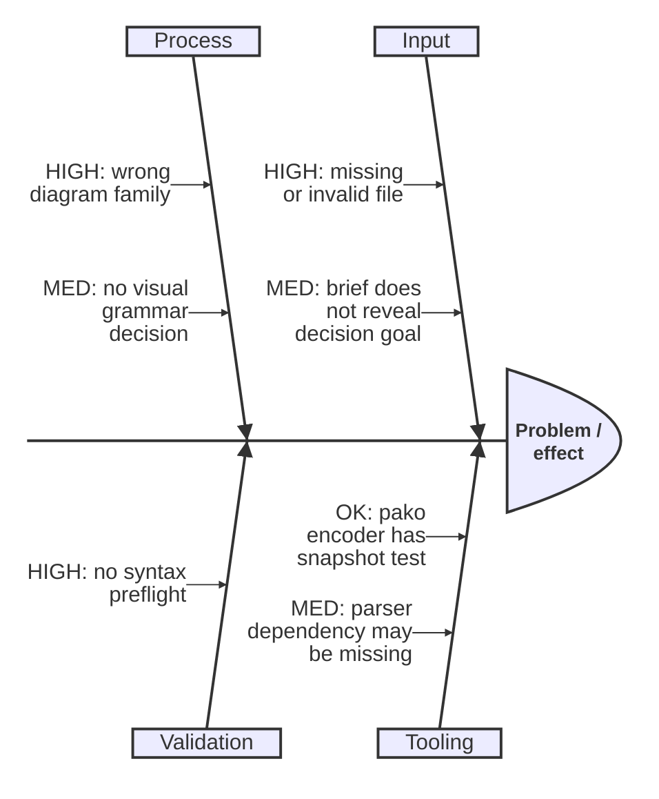
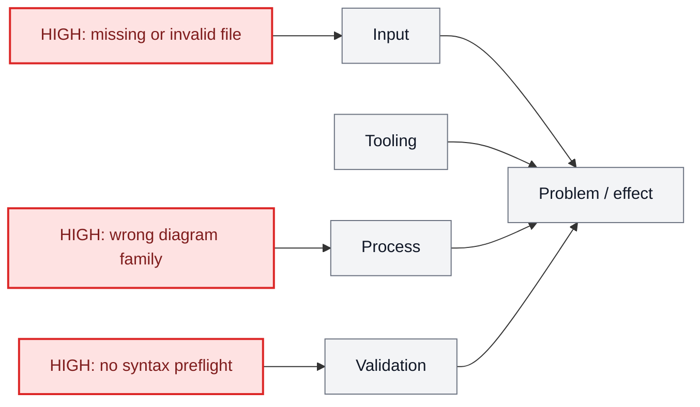

# Mermaid Diagram Selection

Choose the diagram by the question the user is really asking, not by the first noun in the prompt.

## Decision Order

1. Identify the job: explain execution, diagnose causes, show interactions, model data, compare priorities, schedule work, or map structure.
2. Pick the strongest matching diagram from the matrix below.
3. Apply `references/visual-grammar.md` so color and position encode the decision the user needs to make.
4. Create one focused `.mmd` file. If two jobs are equally important, create two diagrams instead of mixing shapes.
5. Run parser preflight with `scripts/mmd.py <file> --preflight-only` and fix syntax before opening.
6. Open the result with `scripts/mmd.py <file> --open`.
7. Report the chosen diagram type, visual grammar, one-sentence rationale, file path, and URL.

## Matrix

| User intent | Best diagram | Mermaid syntax | Use when | Avoid when |
|---|---|---|---|---|
| What happens in what order? | Process flowchart | `flowchart TD` or `flowchart LR` | Steps, branches, happy path, failure path, command execution | The main question is "why" rather than "what next" |
| Why is this happening? | Ishikawa / fishbone cause map | `ishikawa-beta` | Root-cause analysis, failure modes, improvement planning, operational debugging | The user needs exact execution order |
| Who talks to whom over time? | Sequence diagram | `sequenceDiagram` | API calls, agents, services, request/response, handoffs | Static architecture or data shape |
| What states can one thing be in? | State diagram | `stateDiagram-v2` | Lifecycle, status transitions, retry states, approval states | Multiple independent actors are the focus |
| What entities exist and how do they relate? | ER diagram | `erDiagram` | Database tables, domain objects, ownership, cardinality | Behavior over time matters more |
| What classes/modules expose what structure? | Class diagram | `classDiagram` | Object model, package API, inheritance, method/field shape | Relational cardinality is the key point |
| When does work happen? | Gantt or timeline | `gantt` or `timeline` | Roadmaps, milestones, sequencing by date, phased plans | Logic branches or root causes matter |
| How should options be prioritized? | Quadrant chart | `quadrantChart` | Impact/effort, risk/value, urgency/importance | There are dependencies between steps |
| What belongs under what? | Mindmap | `mindmap` | Taxonomy, brainstorming, topic decomposition | Process order or causality matters |
| How does code/repo history branch? | Git graph | `gitGraph` | Release branches, merge strategy, history explanation | Non-git workflows |
| What is the high-level system layout? | Architecture/container map | `flowchart`, `C4Context`, or `C4Container` | Components, boundaries, deployment surfaces | Message timing is the main point |
| How much of a whole? | Pie chart | `pie` | Simple proportions, category share | Trends, sequence, or causality |

## Fishbone Pattern

Mermaid supports native Ishikawa/fishbone diagrams with `ishikawa-beta`. Use that syntax by default for root-cause maps. Only use the `flowchart LR` fallback when the target renderer rejects `ishikawa-beta` or when per-cause `classDef` color styling is more important than the true fishbone layout.

Use categories that fit the domain. Good defaults for software workflows:

- Input
- Tooling
- Environment
- Process
- Dependencies
- UX
- Validation

For decision support, keep category nodes neutral. Put stoplight severity in the cause labels so the viewer can separate taxonomy from severity even when native Ishikawa styling hooks are limited.

Native shape:

Styled fallback when color is required:

## Selection Heuristics

- If the prompt asks "how does this work", use a flowchart unless actors exchanging messages are central.
- If it asks "why", "what can go wrong", "improve", "risk", or "failure modes", use Ishikawa.
- If it names services, APIs, humans, or agents sending things to each other, use sequence.
- If it names statuses, modes, lifecycle, or approvals, use state.
- If it names tables, records, ownership, or cardinality, use ER.
- If it asks for a decision matrix, use a flowchart for routing decisions or a quadrant chart for two-axis prioritization.
- If the user asks for "best .mmd", choose autonomously and state the rationale after the diagram is created.
