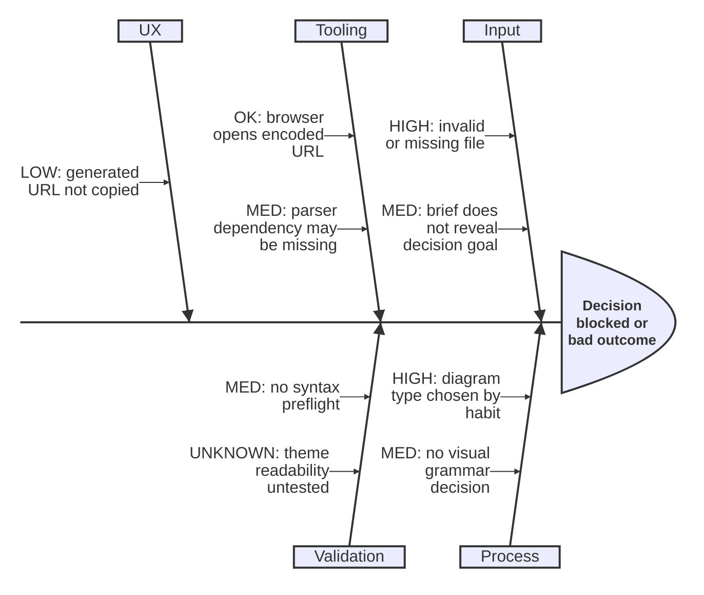

# Mermaid Visual Grammar

Use this after choosing the diagram type. The goal is fast comprehension and better decisions, not visual decoration.

## Core Rules

1. Choose one primary meaning for color: status, severity, confidence, recommendation, or ownership.
2. Use position for structure: sequence, proximity to outcome, priority, grouping, or dependency.
3. Do not encode category and severity with the same color channel. If severity matters, keep categories neutral.
4. Never rely on color alone. Prefix labels with `HIGH`, `MED`, `OK`, `LOW`, `UNKNOWN`, `BLOCKED`, or `RECOMMENDED`.
5. Make the conclusion visually findable: put the effect, bottleneck, decision, or recommendation at the natural destination of the diagram.
6. Use fewer colors than Mermaid permits. Three to five semantic classes usually beats a rainbow.
7. Prefer pale fills with strong strokes for readability in Mermaid Live.

## Reusable Decision Palette

Use these classes in `flowchart`-style diagrams when status or severity matters:

```mermaid
classDef high fill:#fee2e2,stroke:#dc2626,color:#7f1d1d,stroke-width:2px
classDef med fill:#fef3c7,stroke:#d97706,color:#78350f,stroke-width:2px
classDef ok fill:#dcfce7,stroke:#16a34a,color:#14532d,stroke-width:2px
classDef low fill:#e0f2fe,stroke:#0284c7,color:#0c4a6e,stroke-width:1px
classDef unknown fill:#f3f4f6,stroke:#6b7280,color:#111827,stroke-dasharray: 4 3
classDef neutral fill:#f8fafc,stroke:#64748b,color:#0f172a
classDef decision fill:#ede9fe,stroke:#7c3aed,color:#3b0764,stroke-width:2px
classDef recommended fill:#d1fae5,stroke:#059669,color:#064e3b,stroke-width:3px
```

Meaning:

- `high`: likely root cause, severe risk, blocker, or urgent action.
- `med`: plausible issue, moderate risk, investigation needed.
- `ok`: healthy, mitigated, working as intended.
- `low`: low-risk background item or optional improvement.
- `unknown`: insufficient evidence or unverified assumption.
- `neutral`: category, container, context, or structural node.
- `decision`: branch point or explicit choice.
- `recommended`: preferred option or chosen path.

## Chart-Specific Rules

| Diagram | Positioning | Color use | Mermaid mechanics |
|---|---|---|---|
| Flowchart | Put the start top/left and the outcome bottom/right. Put failures off the main path. | Main path neutral/ok, decisions purple, failures high, recommended path green. | `classDef`, `class`, edge labels |
| Ishikawa / fishbone | Effect on the far right. Categories feed the effect. Causes feed categories. Put highest-leverage causes closest to the category/effect. | Keep categories neutral. Put stoplight severity in cause labels. Use `UNKNOWN` for unproven hypotheses. | `ishikawa-beta`; use `flowchart LR` fallback only when colored `classDef` styling is required |
| Sequence | Actors left-to-right in request path order. Put external systems at the edges. | Use notes for failures; color support is limited, so labels carry severity. | `sequenceDiagram`, `Note over`, `rect` blocks when useful |
| State diagram | Stable states central. Error/terminal states lower or to the side. Happy transitions should be visually direct. | Stable `OK`, transient `MED`, error `HIGH`, unknown/manual review `UNKNOWN`. | `stateDiagram-v2`; use explicit state names with status labels |
| ER diagram | Group by domain or ownership in naming. Put core entities first. | Avoid many colors; ER syntax has limited styling. Use names and relationship labels for meaning. | `erDiagram`; clear cardinality labels |
| Class diagram | Put public API/core abstraction first. Supporting classes below or to the right. | Use minimal color; class diagrams depend more on grouping and names. | `classDiagram`; avoid too many methods |
| Gantt/timeline | Chronological left-to-right. Put gates/milestones between phases. | Blocked/critical tasks high, active work med, complete ok. | `gantt`, `crit`, `done`, `active`, milestones |
| Quadrant | Axes do the main work. Best quadrant should be visually obvious. | Color only the recommendation or risk class, not every point. | `quadrantChart`; labels must be short |
| Mindmap | Center is the thesis. First ring is categories. Leaves are details. | Use sparingly; hierarchy matters more than status. | `mindmap` |
| Architecture map | Put users/entry points left/top, data stores right/bottom, external systems at boundaries. | Boundaries neutral, risky coupling high, recommended simplification green. | `flowchart`, subgraphs, classDefs |

## Ishikawa Severity Template

Use this when diagnosing why something fails, underperforms, or blocks a decision.



Native Ishikawa diagrams do not expose stable node ids for `classDef` styling. If the user explicitly asks for colored severity boxes instead of a true fishbone layout, switch to the `flowchart LR` fallback in `diagram-selection.md` and say so.

## Positioning Heuristics

- In `LR` diagrams, the eye expects cause/input on the left and effect/output on the right.
- In `TD` diagrams, the eye expects start at the top and result at the bottom.
- Put the preferred action on the cleanest path with the fewest bends.
- Put exceptions, risks, and uncertain branches off the main path.
- Put highly related nodes close together; distance should imply conceptual distance.
- Do not create visual symmetry if the options are not equal. Make priority visible.

## Labeling Heuristics

- Use verbs on process nodes: `Validate source`, `Encode state`, `Open browser`.
- Use nouns on category nodes: `Input`, `Tooling`, `Validation`.
- Use status prefixes for decision support: `HIGH:`, `MED:`, `OK:`, `UNKNOWN:`.
- Keep labels short enough to scan. Move detail into separate nodes instead of long sentences.
- Make the chart title or effect node answer the user's question.
