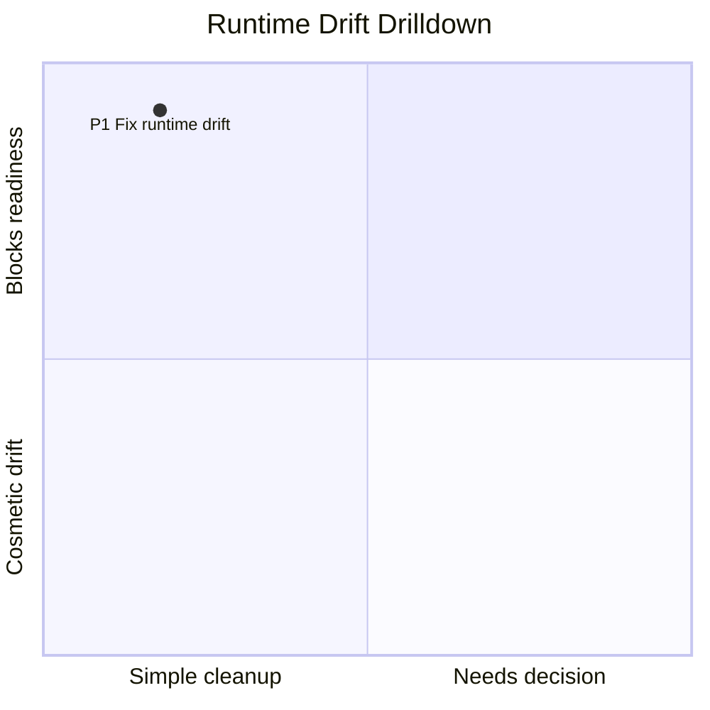
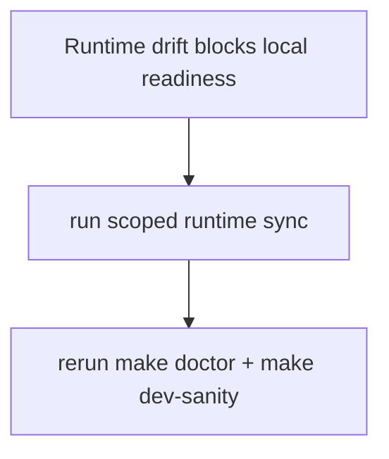

# Buildooor MMDX Diagram Links

## Invocation Contract

Start the first progress update with the exact prefix `Using mmdx`.

## Verification / Closeout

Before closing an MMDX implementation change, run the narrow checks that cover the touched surface. For CLI/script changes, run:

```bash
python3 {{SKILL_DIR}}/scripts/test_mmd.py
python3 {{SKILL_DIR}}/scripts/mmd.py {{SKILL_DIR}}/examples/release-gantt-stack.mmdx --preflight-only
python3 {{SKILL_DIR}}/scripts/mmd.py {{SKILL_DIR}}/examples/release-gantt-stack.mmdx --fragment-only --no-preflight
python3 {{SKILL_DIR}}/../skill-issue/scripts/quick_validate.py {{SKILL_DIR}}
```

For authored diagrams, validate or open the exact `.mmd`/`.mmdx` the user will consume and report the file path plus the generated URL or live short link. Do not mark a publish-link task complete unless dry-run or live verification has proven the target username/slug and source hash.

## Quick Start

Create the best Mermaid diagram from a prose brief:

```bash
# Read references/diagram-selection.md and references/visual-grammar.md,
# choose the diagram type and visual grammar, write a .mmd, then open it with:
python3 {{SKILL_DIR}}/scripts/mmd.py path/to/generated.mmd --open
```

Open a Mermaid source file in the buildooor diagrams viewer:

```bash
python3 {{SKILL_DIR}}/scripts/mmd.py path/to/diagram.mmd --open
```

Open an MMDX chart stack in the buildooor diagrams viewer:

```bash
python3 {{SKILL_DIR}}/scripts/mmd.py path/to/stack.mmdx --open
```

Open with a local tmux handoff channel so the viewer can send selected notes back to the pane that launched it:

```bash
python3 {{SKILL_DIR}}/scripts/mmd.py path/to/diagram.mmd --open --tmux
```

Open with the same handoff channel and automatically press Enter after Send pastes the edit packet:

```bash
python3 {{SKILL_DIR}}/scripts/mmd.py path/to/diagram.mmd --open --tmux --tmux-submit
```

Validate Mermaid syntax without opening a URL:

```bash
python3 {{SKILL_DIR}}/scripts/mmd.py path/to/diagram.mmd --preflight-only
```

Print the editable URL without opening it:

```bash
python3 {{SKILL_DIR}}/scripts/mmd.py path/to/diagram.mmd
```

Read Mermaid source from stdin:

```bash
pbpaste | python3 {{SKILL_DIR}}/scripts/mmd.py - --open
```

Decode an existing Mermaid Live/buildooor diagrams fragment or URL:

```bash
python3 {{SKILL_DIR}}/scripts/mmd.py --decode 'https://mermaid.live/edit#pako:...'
```

## Authenticated MMDX Persistence

Browser and agent auth are two entrances to the same protected MMDX persistence surface.

- Browser pako flow: open the generated `/diagrams#pako:...` URL, click the bottom MMDX `save` control for a durable private version, verify the email magic link if prompted, then return to `/diagrams`. The viewer preserves the pako state in the URL or `mmdxResume` localStorage fallback and resumes the pending save after auth.
- Browser short-link flow: click the top-right `save` control when the user wants a shareable short link for the current pako state, not a private version history record.
- Agent/CLI private-version flow: authenticate the operator or agent through the existing SPAPS device-code flow, then post the saved `.mmd`/`.mmdx` source to Buildooor's `/api/mmdx/diagrams` or `/api/mmdx/diagrams/:id/versions` API with the bearer token. Do not build a separate MMDX auth system or ask a browser user to run device-code auth.
- Agent/CLI existing-short-link flow: after editing a local `.mmd`/`.mmdx`, republish the already-saved short link with `publish-link`. First run the existing SPAPS device-code login (`spaps login --server-url <spaps-url> --client-id <app-slug>`), then pass the stored token via `--access-token-command "spaps token --server-url <spaps-url>"`. Direct env alternatives are `BUILDOOOR_ACCESS_TOKEN`, `SPAPS_ACCESS_TOKEN`, or `--access-token`.

List owned durable MMDX diagrams before choosing a slug or diagram id:

```bash
python3 {{SKILL_DIR}}/scripts/mmd.py list \
  --access-token-command "spaps token --server-url https://api.sweetpotato.dev"
```

`list` reads the authenticated owner library and prints `id`, `slug`, `title`,
`visibility`, and `updated_at`. Use `--json` when a downstream agent needs the
raw owner-list payload, and `--dry-run` to verify the resolved URL and redacted
headers without touching the network.

```bash
python3 {{SKILL_DIR}}/scripts/mmd.py publish-link path/to/file.mmdx \
  --username buildooor \
  --slug mmdx-68I8Xjv1v3FK \
  --title "PDS Project Status Crux" \
  --access-token-command "spaps token --server-url https://api.sweetpotato.dev"
```

Dry-run the exact payload without touching production:

```bash
python3 {{SKILL_DIR}}/scripts/mmd.py publish-link path/to/file.mmdx \
  --username buildooor \
  --slug mmdx-68I8Xjv1v3FK \
  --dry-run
```

`publish-link` preflights the source, encodes the same `pako:` state used by `/diagrams`, PATCHes the authenticated Buildooor app-link proxy, then fetches the live `/mmdx/<username>/<slug>` page and verifies `__NEXT_DATA__.initialDiagramFragment` matches the local state. It must fail closed if auth, the update API, or live verification is unavailable. Do not SSH into production or patch SPAPS database rows to update a short link.

## MMDX Directory Index

`INDEX.mmdx` at the skill root is a machine-wide directory of every `.mmdx`. It renders as a Gantt chart — sections by repo, bars by file, positioned by edit date. Each bar `click`s through to the actual `.mmdx` opened in the buildooor diagrams viewer (pako-encoded). Status colors: `crit` = edited in last 24h, `active` = last 7d, `done` = older.

**Always refresh before opening** — file mtimes change as the user works:

```bash
python3 {{SKILL_DIR}}/scripts/mmdx_index.py
python3 {{SKILL_DIR}}/scripts/mmd.py {{SKILL_DIR}}/INDEX.mmdx --open
```

## Invocation Routing

- Existing file path or stdin: encode/open that source directly.
- Mermaid Live URL, buildooor diagrams URL, or `pako:`/`base64:` fragment: decode it.
- `.mmdx` file path or prose asking for chart stacking/drilldown: create or open an MMDX chart stack.
- Natural-language brief: choose the diagram type, create a `.mmd`, then open it.
- Requests for "best", "what diagram", "matrix", "root cause", "timeline", "sequence", "schema", or "architecture": treat as a diagram-selection task, not a generic flowchart task.
- **Index/directory requests** ("show me my mmdx", "all the mmdx I have", "mmdx index", "directory of diagrams", "what mmdx exist", "open the index", "refresh the index"): always run `mmdx_index.py` first to refresh, then open `INDEX.mmdx`. Do not show a stale index.

## Diagram Selection

Use [references/diagram-selection.md](references/diagram-selection.md) before authoring from prose, then apply [references/visual-grammar.md](references/visual-grammar.md) before writing Mermaid.

Default rule: choose the diagram that answers the user's implied question. Do not default to `flowchart` unless the question is actually about order, branching, or control flow.

Say the decision in one sentence after creating the file:

```text
I chose an Ishikawa-style cause map because the prompt is about diagnosing why the workflow can fail.
```

Ask a clarifying question only when the user is asking for a deliverable where the wrong diagram would materially change the conclusion. Otherwise make the decision, write the `.mmd`, open it, and report the path plus URL.

## Decision-Grade Visuals

Default rule: visual encoding must serve the user's decision, not decorate the chart.

- Use position for structure, priority, sequence, or proximity to the outcome.
- Use color for status, severity, confidence, or recommendation.
- Do not use the same color channel for both category and severity.
- Never rely on color alone. Include short labels such as `HIGH`, `MED`, `OK`, `LOW`, `UNKNOWN`, or `BLOCKED`.
- Prefer muted category nodes and stronger color on the actionable leaf nodes.
- Put the most important conclusion, bottleneck, effect, or recommendation where the eye naturally lands for that chart type.

For an Ishikawa/fishbone chart, use native Mermaid `ishikawa-beta` syntax by default. Keep categories neutral and put severity in the cause labels:

- `HIGH`: likely root cause, severe, or blocking.
- `MED`: plausible, partial, or worth investigating.
- `OK`: healthy, mitigated, or working as intended.
- `UNKNOWN`: insufficient evidence.

Native `ishikawa-beta` has limited per-cause styling hooks. If colored stoplight styling is more important than the fishbone layout, use the documented `flowchart LR` fallback and explicitly say it is a fallback, not a native Ishikawa chart.

When the prompt asks for the "best" diagram, also choose the best visual grammar and state both decisions:

```text
I chose an Ishikawa cause map with stoplight severity because the prompt is about diagnosing what blocks useful decisions.
```

## Chart Stacking With MMDX

Use MMDX when a single chart is too dense and the user needs progressive disclosure:
a top-level decision chart, plus one or more linked subtype/detail charts. This is a
thin wrapper around Mermaid, not a Mermaid fork. Each chart remains ordinary Mermaid;
MMDX adds names, an entry chart, and label-to-chart links.

Good MMDX triggers:

- "click into this option"
- "infinite load"
- "drill down"
- "subchart"
- "chart stacking"
- "show more detail for this point"
- "unblock me" when the blocker is a mix of command-proof and human-only gates
- release, deploy, TestFlight, App Store, or beta timelines with linked proof
- a quadrant/matrix/roadmap item needs a second chart of a different type

Default chart-stacking methodology:

- Make the entry chart the decision surface, not an index page.
- Link only the high-leverage elements first; avoid turning every label into a link.
- Let child charts change type. For example, a quadrant point can open a flowchart,
  sequence, Gantt, Ishikawa, state diagram, or another quadrant.
- Keep link labels short, unique, and exactly visible on the source chart.
- Prefer one or two stack levels until the user proves they need more.
- Do not render a side menu of child links. Linked elements should be clicked on the
  chart itself; the side UI is for "back" after drilldown.
- Use the child chart to answer "why, what next, or what blocks it", not to repeat the
  parent label at larger size.
- For `/diagrams` wand drilldown packets, treat the request as a same-agent continuation
  from the creator pane that opened the chart. Use the already-invoked MMDX skill,
  the attached source path, the active chart id/title, selected label, nearby Mermaid
  context, and local repo context. Do not ask the user for more context unless the
  source is unreadable or the repo grounding is genuinely unavailable.
- For `/diagrams` wand clipboard packets, assume the receiving agent may be a fresh
  session with no creator-pane state. Ground in the embedded MMDX skill reference,
  source path, active chart id/title, selected label, and included Mermaid context
  before patching. Treat a copied packet as successful clipboard mode, not as a
  failed bridge handoff.
- A wand request creates exactly one high-leverage child chart. Consider several chart
  families first, pick the most accretive one, patch the `.mmdx` source and link, validate
  every chart, reopen the stack, then briefly say which child chart you picked and why.
  If a close alternative was plausible, name it as an optional change after the rationale.
- For release plans, make the entry chart a Gantt or state chart, then link only the gates
  whose evidence or owner is not obvious.

For release or beta operations, prefer a Gantt entry chart plus child charts for proof,
manual gates, rollback, and next action. Use [references/release-gantt-mmdx.md](references/release-gantt-mmdx.md)
and [examples/release-gantt-stack.mmdx](examples/release-gantt-stack.mmdx) as the pattern.

MMDX file shape:

````markdown
<!-- mmdx
{
  "entry": "main",
  "links": [
    {
      "from": "main",
      "label": "P1 Fix runtime drift",
      "to": "runtime-drift-detail",
      "title": "Open runtime drift detail"
    }
  ]
}
-->

## chart main Runtime Drift Priority


## chart runtime-drift-detail Runtime Drift Detail

````

Open it locally:

```bash
python3 {{SKILL_DIR}}/scripts/mmd.py path/to/stack.mmdx --open
```

Validate every chart in the stack:

```bash
python3 {{SKILL_DIR}}/scripts/mmd.py path/to/stack.mmdx --preflight-only
```

MMDX is encoded into the pako state and rendered by buildooor `/diagrams`.
When `.mmdx` files are opened with `--tmux`, the source path is attached and
the local bridge validates source reads/writes as full MMDX documents. This is
what lets a wand click patch the original stack rather than only copying a prompt.

## Encoding Contract

Mermaid Live Editor serializes state as:

1. Build a state object with `code`, `grid`, `mermaid`, `panZoom`, `rough`, and `updateDiagram`.
2. `JSON.stringify` the state with no extra spaces.
3. UTF-8 encode the JSON.
4. Compress with zlib/DEFLATE level 9, matching `pako.deflate(data, { level: 9 })`.
5. URL-safe base64 encode the compressed bytes without padding.
6. Prefix the fragment with `pako:`.

The bundled script implements that path with Python standard-library `json`, `zlib`, and `base64`, then opens the `https://buildooor.com/diagrams#pako:...` URL through `osascript`. For `.mmdx`, the state `code` is the entry chart and the private `buildooorMmdx` field carries the named chart stack and links.

When `--tmux` is passed, the script also starts an ephemeral localhost handoff server and adds a `buildooorHandoff` object to the compressed state, including the launcher command the browser should place in reopen instructions. For file inputs, including `.mmdx`, it also adds `buildooorSource` with the resolved source path. The browser reads that private hash metadata and shows `send to <tmux target>` instead of relying on clipboard copy. In handoff mode, the prompt panel previews the exact agent edit packet that will be sent. The server validates an unguessable token, accepts bridge calls only from the output URL origin, expires by TTL, and pastes an edit packet into the target tmux pane without pressing Enter by default. If `--tmux-submit` is also passed, Send pastes the edit packet and then presses Enter in the target pane. If the localhost handoff is unavailable when the user presses Send, the app copies the same agent edit packet to the clipboard as a recovery path. If a wand drilldown has no bridge, or the bridge fails, the app copies a fresh-session wand packet with an embedded MMDX skill reference so another agent can load the workflow, patch the stack, validate it, and reopen it without prior tmux context.

## Local Bridge Ownership

The localhost handoff server belongs to this skill, not to the buildooor app. `scripts/mmd.py --tmux` starts the ephemeral bridge and embeds its endpoint, token, target tmux pane, source path, launcher command, and capabilities into the private `buildooorHandoff`/`buildooorSource` state.

The bridge CORS policy is origin-pinned. By default, the allowed origin is derived from the output URL (`https://buildooor.com` for the hosted viewer, or the origin of `--base-url` for local development). Use `--handoff-origin` only when the browser origin cannot be inferred from the output URL.

The buildooor `/diagrams` page is the browser client for that bridge. It may render selection UI, notes, packet previews, source-edit controls, and send/submit buttons, but it should discover local capabilities from the pako state and call the MMDX bridge. Do not add buildooor Next API routes for local `.mmd` file reads, writes, preflight, file watching, or tmux submission.

Direct-edit behavior must extend the token-gated MMD bridge first, then add browser UI that consumes those endpoints. The bridge currently supports:

- `POST /source/read`: return the attached `.mmd` or `.mmdx` source file.
- `POST /source/preflight`: validate submitted code, or the attached file when no code is supplied. `.mmdx` sources validate every chart in the stack.
- `POST /source/write`: validate submitted code first, then save it to the attached `.mmd` or `.mmdx` file only if validation succeeds.

The browser must not choose arbitrary filesystem paths. It can only operate on the source file attached by `scripts/mmd.py --tmux`. Future bridge additions should follow the same pattern for file status/watch and explicit submit.

## Parser Preflight

The script validates Mermaid syntax with Mermaid's own npm parser before encoding or opening.

- Default behavior: run parser preflight first, auto-installing the pinned parser dependency from `scripts/package.json` when missing.
- `--preflight-only`: validate syntax and print the detected diagram type without producing a URL.
- `--no-preflight`: bypass parser validation for drafts or unsupported edge cases.
- `--no-parser-install`: fail instead of auto-installing the parser dependency.
- `--setup-parser`: install the parser dependency explicitly.

If preflight fails, fix the `.mmd` before opening Mermaid Live unless the user explicitly asks to inspect a broken draft.

## Common Options

- `--open`: open the generated URL with the bundled AppleScript launcher.
- `--view`: accepted for compatibility; buildooor diagrams uses one URL.
- `--fragment-only`: print only `pako:...`.
- `--tmux` / `--tmux-handoff`: attach a local handoff channel for the diagrams viewer's Send and wand buttons. For `.mmdx`, this attaches source-edit metadata so the creator agent can patch and reopen the stack.
- `--tmux-target <target>`: override the tmux target pane; defaults to the current pane.
- `--tmux-submit`: after Send pastes into the target pane, press Enter automatically.
- `--handoff-ttl <seconds>`: lifetime for the local handoff channel, default 600.
- `--handoff-origin <origin-or-url>`: browser origin allowed to call the local handoff bridge; defaults to the output URL origin.
- `--preflight-only`: validate Mermaid syntax and exit.
- `--no-preflight`: skip parser validation.
- `--theme <name>`: set the Mermaid config theme, default `default`.
- `--config <json-or-path>`: use a custom Mermaid config JSON string or file.
- `--decode <url-or-fragment>`: decode a Mermaid Live URL or fragment into JSON state.

## Verification

After changes to the script, run:

```bash
python3 {{SKILL_DIR}}/scripts/test_mmd.py
python3 {{SKILL_DIR}}/scripts/mmd.py {{SKILL_DIR}}/examples/ishikawa-stoplight.mmd --preflight-only
```

For MMDX/chart-stacking changes, also run:

```bash
python3 {{SKILL_DIR}}/scripts/mmd.py path/to/stack.mmdx --preflight-only
python3 {{SKILL_DIR}}/scripts/mmd.py path/to/stack.mmdx --fragment-only --no-preflight
python3 {{SKILL_DIR}}/scripts/mmd.py {{SKILL_DIR}}/examples/release-gantt-stack.mmdx --preflight-only
```

For a numeric `/crap` score on the bridge, generate a temporary coverage artifact first:

```bash
cd {{SKILL_DIR}}/scripts
python3 -m coverage run --source=. test_mmd.py
python3 -m coverage xml -o coverage.xml
python3 {{SKILL_DIR}}/../crap/scripts/analyze_crap.py {{SKILL_DIR}}/scripts --languages python --top 10
```

For authoring changes, also round-trip the generated file:

```bash
frag=$(python3 {{SKILL_DIR}}/scripts/mmd.py path/to/generated.mmd --fragment-only)
python3 {{SKILL_DIR}}/scripts/mmd.py --decode "$frag" --code-only | diff -u path/to/generated.mmd -
```
