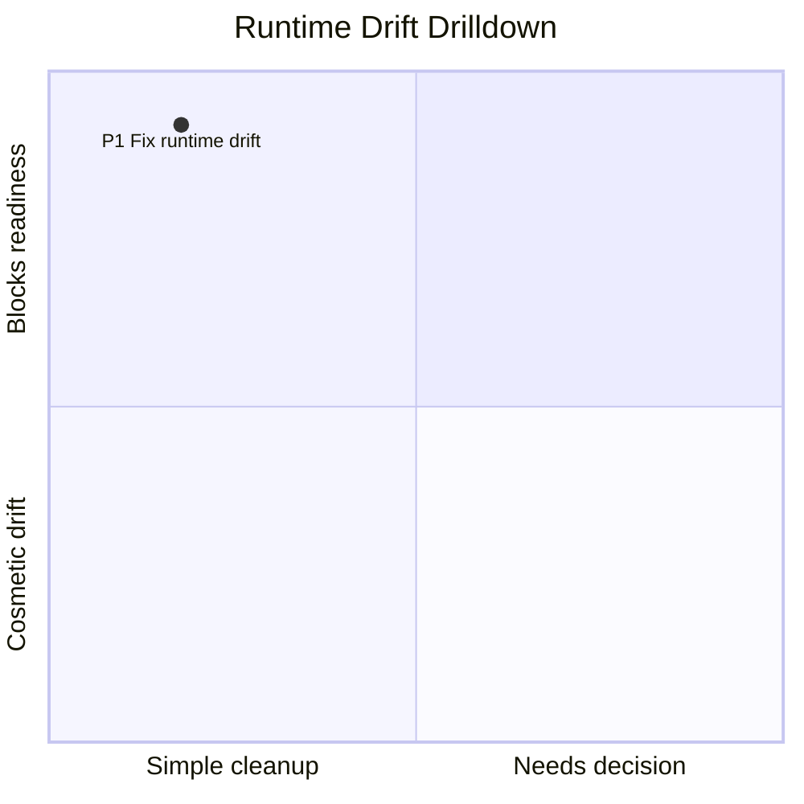
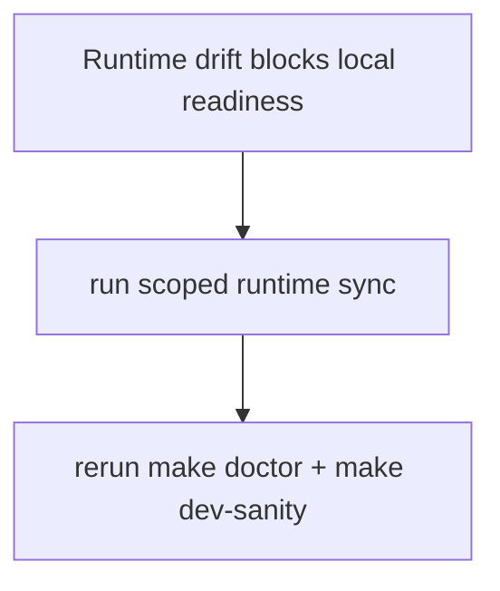

# Buildooor MMDX Diagram Links

## Invocation Contract

Start the first progress update with the exact prefix `Using mmdx`.

## Verification / Closeout

Before closing an MMDX implementation change, run the narrow checks that cover the touched surface. For CLI/script changes, run:

```bash
python3 {{SKILL_DIR}}/scripts/test_mmd.py
python3 {{SKILL_DIR}}/scripts/mmd.py {{SKILL_DIR}}/examples/release-gantt-stack.mmdx --preflight-only
python3 {{SKILL_DIR}}/scripts/mmd.py {{SKILL_DIR}}/examples/release-gantt-stack.mmdx --fragment-only --no-preflight
python3 {{SKILL_DIR}}/../skill-issue/scripts/quick_validate.py {{SKILL_DIR}}
```

For authored diagrams, validate or open the exact `.mmd`/`.mmdx` the user will consume and report the file path plus the durable diagram id/version id, generated URL, or live short link. Do not mark a durable private save complete unless `save` proves `latest_verification=OK` or the equivalent API response shows the latest `mmdx_text` matches the local source. Do not mark a publish-link task complete unless dry-run or live verification has proven the target username/slug and source hash. A live short link is not proof that the diagram appears in the authenticated account gallery; only `save` creates or appends the durable "My Diagrams" record.

## Quick Start

Create the best Mermaid diagram from a prose brief:

```bash
# Read references/diagram-selection.md and references/visual-grammar.md,
# choose the diagram type and visual grammar, write a .mmd, then print the URL:
python3 {{SKILL_DIR}}/scripts/mmd.py path/to/generated.mmd

# Optional convenience: also ask the local OS to open the same URL.
python3 {{SKILL_DIR}}/scripts/mmd.py path/to/generated.mmd --open
```

Create a new private durable MMDX diagram in the operator's existing Buildooor account:

```bash
python3 {{SKILL_DIR}}/scripts/mmd.py save path/to/stack.mmdx \
  --title "Project Status" \
  --chart-slug project-status
```

Append a version to an owned durable diagram:

```bash
python3 {{SKILL_DIR}}/scripts/mmd.py save path/to/stack.mmdx \
  --diagram-id <diagram-id> \
  --save-note "agent update"
```

`save` reads `BUILDOOOR_ACCESS_TOKEN`, `SPAPS_ACCESS_TOKEN`,
`BUILDOOOR_ACCESS_TOKEN_COMMAND`, or `SPAPS_TOKEN_COMMAND` by default. With
`--diagram-id`, it fetches `/latest` when `--base-version-id` is omitted, posts
the new version, then fetches `/latest` again to verify the saved source.

Print a Mermaid source file URL for the buildooor diagrams viewer:

```bash
python3 {{SKILL_DIR}}/scripts/mmd.py path/to/diagram.mmd
```

Open the same URL as an optional local convenience:

```bash
python3 {{SKILL_DIR}}/scripts/mmd.py path/to/diagram.mmd --open
```

Print an MMDX chart stack URL for the buildooor diagrams viewer:

```bash
python3 {{SKILL_DIR}}/scripts/mmd.py path/to/stack.mmdx
```

Open the same URL as an optional local convenience:

```bash
python3 {{SKILL_DIR}}/scripts/mmd.py path/to/stack.mmdx --open
```

Open with a local tmux handoff channel so the viewer can send selected notes back to the pane that launched it:

```bash
python3 {{SKILL_DIR}}/scripts/mmd.py path/to/diagram.mmd --open --tmux
```

Open with the same handoff channel and automatically press Enter after Send pastes the edit packet:

```bash
python3 {{SKILL_DIR}}/scripts/mmd.py path/to/diagram.mmd --open --tmux --tmux-submit
```

Validate Mermaid syntax without opening a URL:

```bash
python3 {{SKILL_DIR}}/scripts/mmd.py path/to/diagram.mmd --preflight-only
```

Print the editable URL without opening it:

```bash
python3 {{SKILL_DIR}}/scripts/mmd.py path/to/diagram.mmd
```

Read Mermaid source from stdin on Linux when `xclip` is installed:

```bash
xclip -selection clipboard -o | python3 {{SKILL_DIR}}/scripts/mmd.py -
```

Read Mermaid source from stdin on Linux when `xsel` is installed:

```bash
xsel -b -o | python3 {{SKILL_DIR}}/scripts/mmd.py -
```

Read Mermaid source from stdin from a file on any platform:

```bash
python3 {{SKILL_DIR}}/scripts/mmd.py - < path/to/diagram.mmd
```

macOS-only clipboard recipe:

```bash
pbpaste | python3 {{SKILL_DIR}}/scripts/mmd.py -
```

Decode an existing Mermaid Live/buildooor diagrams fragment or URL:

```bash
python3 {{SKILL_DIR}}/scripts/mmd.py --decode 'https://mermaid.live/edit#pako:...'
```

## Authenticated MMDX Persistence

Browser and agent auth are two entrances to the same protected MMDX persistence surface.

- Operator account-save contract: for any owned/authenticated MMDX request,
  the primary completion path is `mmd.py save`. `publish-link` creates or
  refreshes a shareable short URL, but it does not populate the Buildooor
  "My Diagrams" gallery and must not be used as the final artifact for "save
  this to my account", "my mmdx", "owned diagram", project-status MMDX, or
  similar requests.
- Default durable-agent flow: when the user says "mmdx", "create a private mmdx",
  "update my mmdx", "owned mmdx", "on my buildooor account", or similar, do
  not stop at a pako URL. Author or patch the `.mmd`/`.mmdx`, run `mmd.py save`,
  and report the durable `diagram_id`, `version_id`, local source path, and
  verification result. Use pako-only output only when the user explicitly asks
  for an ephemeral/open link, as a preview before the durable save, or in the
  auth-failure recovery packet below.
- Browser pako flow: open the generated `/diagrams#pako:...` URL, click the bottom MMDX `save` control for a durable private version, verify the email magic link if prompted, then return to `/diagrams`. The viewer preserves the pako state in the URL or `mmdxResume` localStorage fallback and resumes the pending save after auth.
- Browser short-link flow: click the top-right `save` control when the user wants a shareable short link for the current pako state, not a private version history record.
- Agent/CLI private-version flow: authenticate the operator or agent through the existing SPAPS device-code flow, then run `mmd.py save` to post the saved `.mmd`/`.mmdx` source to Buildooor's `/api/mmdx/diagrams` or `/api/mmdx/diagrams/:id/versions` API with the bearer token. Do not build a separate MMDX auth system or ask a browser user to run device-code auth.
- Agent/CLI short-link flow: after editing a local `.mmd`/`.mmdx`, use
  `publish-link --create` to mint the first hosted short link or
  `publish-link --username <owner> --slug <slug>` to republish an existing one
  only when the requested artifact is the short link itself or the user
  explicitly asks for a share URL in addition to the private save. First run the
  existing SPAPS device-code login (`spaps login --server-url <spaps-api-base>
  --client-id buildooor` unless the environment overrides it), then pass the
  stored token via `--access-token-command "spaps token --server-url
  <spaps-api-base>"`. Direct env alternatives are `BUILDOOOR_ACCESS_TOKEN`,
  `SPAPS_ACCESS_TOKEN`, or `--access-token`.

Important URL distinction for device-code auth:

- `--server-url` is the SPAPS API base used by the CLI to request and poll the device code. Resolve it from `MMDX_SPAPS_SERVER_URL`, then `SPAPS_API_URL`, then `NEXT_PUBLIC_SPAPS_API_URL`, then repo-local `.spaps/app.json` for local mode. If none is available, ask the operator which SPAPS API base to use instead of guessing from stale examples.
- The browser approval URL is the app-specific verifier shown to the human. For Buildooor production, use `https://buildooor.com/auth/device?user_code=<code>`. If the CLI prints a generic SPAPS API-host URL such as `<spaps-api-base>?user_code=<code>`, keep the CLI polling the SPAPS API base but tell the operator to open the Buildooor verifier URL with the same code.
- Do not claim auth is blocked merely because `spaps` is not on `PATH`. In the Sweet Potato monorepo, the CLI can be run directly with `node ../sweet-potato/packages/spaps/bin/spaps.js ...`; outside that checkout, use the installed or published `spaps` package.

Agent auth prerequisite: before claiming that durable agent-side save or short-link publishing is blocked,
check whether `BUILDOOOR_ACCESS_TOKEN`, `SPAPS_ACCESS_TOKEN`,
`BUILDOOOR_ACCESS_TOKEN_COMMAND`, or `SPAPS_TOKEN_COMMAND` is available in the
current shell. `mmd.py list` and `mmd.py publish-link` read those variables by
default. When none is present, the CLI fails closed with an exact device-code
mint recipe (`spaps login --server-url <resolved> --client-id buildooor`, the
verifier URL, and the `export`/`--access-token-command` forms) resolved from
`MMDX_SPAPS_SERVER_URL` > `SPAPS_API_URL` > `NEXT_PUBLIC_SPAPS_API_URL`. Relay
that recipe to the operator verbatim instead of hand-constructing the login.

If the token is missing on an operator machine, use the `skill-issue` shell-profile
secret pattern: keep the bearer token in the OS keychain or another secret store,
then export it from `~/.zshrc`/`~/.bash_profile` so every project shell sees it.
Do not put raw bearer tokens in a repo, skill file, checked-in shell snippet, or
agent transcript.

macOS-only Keychain setup example:

```bash
security add-generic-password -U -a "$USER" -s buildooor-access-token -w '<token>'
```

Then source it from the operator shell profile:

```bash
if [[ -z "${BUILDOOOR_ACCESS_TOKEN:-}" ]] && command -v security >/dev/null 2>&1; then
  _buildooor_access_token="$(security find-generic-password -a "$USER" -s buildooor-access-token -w 2>/dev/null || true)"
  if [[ -n "$_buildooor_access_token" ]]; then
    export BUILDOOOR_ACCESS_TOKEN="$_buildooor_access_token"
  fi
  unset _buildooor_access_token
fi
```

If both Buildooor and SPAPS names are used on the machine, prefer exporting the
specific token name the tool expects. For the bundled MMDX CLI either
`BUILDOOOR_ACCESS_TOKEN` or `SPAPS_ACCESS_TOKEN` is sufficient.

Linux/headless equivalent: use the platform secret manager or a local
token-command wrapper and export only the command from the shell profile, for
example `export SPAPS_TOKEN_COMMAND='spaps token --server-url "$SPAPS_API_URL"'`.
Do not store raw bearer tokens in checked-in files or paste them into prompts.

List owned durable MMDX diagrams before choosing a slug or diagram id:

```bash
SPAPS_MMDX_AUTH_SERVER_URL="${MMDX_SPAPS_SERVER_URL:-${SPAPS_API_URL:-${NEXT_PUBLIC_SPAPS_API_URL:-}}}"
test -n "$SPAPS_MMDX_AUTH_SERVER_URL" || {
  echo "Set MMDX_SPAPS_SERVER_URL or SPAPS_API_URL before agent-side MMDX auth" >&2
  exit 2
}

python3 {{SKILL_DIR}}/scripts/mmd.py list \
  --access-token-command "spaps token --server-url $SPAPS_MMDX_AUTH_SERVER_URL"
```

`list` reads the authenticated owner library and prints `id`, `slug`, `title`,
`visibility`, and `updated_at`. Use `--json` when a downstream agent needs the
raw owner-list payload, and `--dry-run` to verify the resolved URL and redacted
headers without touching the network. Use `--visibility private|unlisted|public`,
`--slug-contains <text>`, `--limit <n>`, and `--offset <n>` when selecting from a
large owned library; server pagination returns `limit`, `offset`, and
`total_count` when the proxy supports it.

List versions for an owned durable diagram:

```bash
python3 {{SKILL_DIR}}/scripts/mmd.py versions <diagram-id-from-list> \
  --json \
  --access-token-command "spaps token --server-url $SPAPS_MMDX_AUTH_SERVER_URL"
```

Update sharing metadata for an owned durable diagram:

```bash
python3 {{SKILL_DIR}}/scripts/mmd.py sharing <diagram-id-from-list> \
  --visibility unlisted \
  --title "Updated diagram title" \
  --chart-slug updated-diagram-title \
  --access-token-command "spaps token --server-url $SPAPS_MMDX_AUTH_SERVER_URL"
```

Delete an owned durable diagram only when the user explicitly wants removal:

```bash
python3 {{SKILL_DIR}}/scripts/mmd.py delete <diagram-id-from-list> \
  --yes \
  --access-token-command "spaps token --server-url $SPAPS_MMDX_AUTH_SERVER_URL"
```

`versions`, `sharing`, and `delete` all support `--json` and `--dry-run`; dry
runs print redacted request metadata and do not call the network. `delete`
refuses to run without explicit `--yes`.

Create a new durable private diagram:

```bash
python3 {{SKILL_DIR}}/scripts/mmd.py save path/to/file.mmdx \
  --title "PDS Project Status Crux" \
  --chart-slug pds-project-status-crux \
  --access-token-command "spaps token --server-url $SPAPS_MMDX_AUTH_SERVER_URL"
```

Append a version to an existing owned diagram:

```bash
python3 {{SKILL_DIR}}/scripts/mmd.py save path/to/file.mmdx \
  --diagram-id <diagram-id-from-list> \
  --save-note "Updated agent handoff status" \
  --access-token-command "spaps token --server-url $SPAPS_MMDX_AUTH_SERVER_URL"
```

Dry-run the exact private-save payload without touching production:

```bash
python3 {{SKILL_DIR}}/scripts/mmd.py save path/to/file.mmdx \
  --title "PDS Project Status Crux" \
  --chart-slug pds-project-status-crux \
  --dry-run --summary
```

`save` fails closed if auth, mutation, or latest-source verification is
unavailable. If `MMDX_PROFILE_REQUIRED` is returned, claim or repair the
Buildooor MMDX profile through the existing browser/device-code flow, then rerun
the same `save` command. Do not replace a failed durable save with only a pako
link unless the user approves the fallback.

Auth-failure recovery packet: when `save` cannot run because auth is missing,
expired, rejected, or pending human approval, return all of these in the handoff
instead of substituting `publish-link`:

- the local source path that still needs durable saving
- an immediate pako preview URL or fragment generated from that source
- the exact device-code login command, defaulting to
  `spaps login --server-url https://api.sweetpotato.dev --client-id buildooor`
  when no environment override is present
- the Buildooor verifier URL and user code printed by the login command if the
  agent started the device-code flow; otherwise show
  `https://buildooor.com/auth/device?user_code=<code>` as the approval shape
- the exact `mmd.py save ...` command to rerun after approval

Auth failure map:

- `list` or `save` returns `401`: the token command/env exists but the resolved
  bearer token is missing, expired, or not accepted for Buildooor MMDX. Do not
  keep retrying `save`, and do not call `publish-link` a replacement success.
  Generate the auth-failure recovery packet, re-run the SPAPS/Buildooor login
  for the account, then prove auth with `mmd.py list` before attempting the
  durable mutation again.
- `MMDX_PROFILE_REQUIRED`: auth is accepted, but the Buildooor MMDX profile is
  not claimed for the account. Claim/repair the profile through the existing
  browser/device-code flow, then rerun `save`.
- `MMDX_CHART_SLUG_TAKEN`: choose an existing owned diagram from `list` and
  append with `save --diagram-id`, or pick a new chart slug.

Short-link publishing is not a durable gallery save. Use it after `save` only
when the user also needs a public/share URL, or by itself only when the user
asked specifically to update an existing short link.

```bash
python3 {{SKILL_DIR}}/scripts/mmd.py publish-link path/to/file.mmdx \
  --create \
  --title "PDS Project Status Crux" \
  --write-short-link-metadata \
  --access-token-command "spaps token --server-url $SPAPS_MMDX_AUTH_SERVER_URL"
```

The create form POSTs the same hosted `/diagrams` app-link payload the browser
uses, returns the created `{username, slug, url}`, live-verifies the returned
`/mmdx/<username>/<slug>` page, and, with `--write-short-link-metadata`, records
the returned short link in the local `.mmdx` header without rewriting the chart
body.

```bash
python3 {{SKILL_DIR}}/scripts/mmd.py publish-link path/to/file.mmdx \
  --username buildooor \
  --slug mmdx-68I8Xjv1v3FK \
  --title "PDS Project Status Crux" \
  --access-token-command "spaps token --server-url $SPAPS_MMDX_AUTH_SERVER_URL"
```

Dry-run the exact payload without touching production:

```bash
python3 {{SKILL_DIR}}/scripts/mmd.py publish-link path/to/file.mmdx \
  --username buildooor \
  --slug mmdx-68I8Xjv1v3FK \
  --dry-run --summary
```

`publish-link` preflights the source, encodes the same `pako:` state used by
`/diagrams`, POSTs or PATCHes the authenticated Buildooor app-link proxy, then
fetches the live `/mmdx/<username>/<slug>` page and verifies
`__NEXT_DATA__.initialDiagramFragment` matches the local state. It must fail
closed if auth, the mutation API, or live verification is unavailable. A `402
DIAGRAMS_PRO_REQUIRED` create failure is surfaced as the structured paywall
error with the `$15/month` price context and no stack trace. Do not SSH into
production or patch SPAPS database rows to update a short link.

## Paid Surfaces

Diagrams Pro is a paid surface only when the operator asks for a hosted or
durable Buildooor write that the API rejects as Pro-gated. The current
Buildooor price display is `$15/month`; cite it only from
`/srv/skillbox/repos/buildooor/lib/diagrams/diagrams-page-logic.ts:223-227`
(`DIAGRAMS_PRO_PRICE_DISPLAY`). Do not invent discounts, annual pricing, quota
numbers, or guarantees not present in the API response.

Pro and quota error map:

| HTTP/code | Surface | Meaning | Agent action |
| --- | --- | --- | --- |
| `402 DIAGRAMS_PRO_REQUIRED` | `/api/app-links` create/update for hosted `/diagrams` share links | The signed-in user does not have Diagrams Pro for hosted diagram app-links. | Relay the upgrade message below, then keep the local `.mmd`/`.mmdx` and pako URL available. |
| `402 MMDX_DIAGRAMS_PRO_REQUIRED` | Buildooor backend durable MMDX create, append, share, invite, or save-intent commit | The authenticated user is trying a durable MMDX action without Diagrams Pro. | Relay the upgrade message below, naming the durable action that failed. |
| `402 DIAGRAMS_PRO_QUOTA_EXCEEDED` | Hosted `/diagrams` app-link create/update usage authorization | The user has Pro, but the hosted-record quota for this usage window is exhausted. | Do not pitch upgrade as the fix. Preserve local work, report quota exhaustion, and offer local/pako output or retry later. |
| `402 MMDX_DIAGRAMS_HOSTED_RECORD_QUOTA_EXCEEDED` | Buildooor backend durable hosted-record quota | The user's durable MMDX hosted-record quota is exhausted. | Do not pitch upgrade as the fix. Preserve local work and offer a local/pako fallback or retry later. |
| `503 DIAGRAMS_PRO_PROVISIONING_ERROR` | Hosted `/diagrams` app-link usage metadata | The account appears to be paying, but Pro usage provisioning/config is missing or inconsistent. | Do not relay an upgrade pitch. Say this is a provisioning issue for a paying account and preserve local work. |
| `503 DIAGRAMS_PRO_CHECK_UNAVAILABLE`, `503 MMDX_DIAGRAMS_PRO_CHECK_UNAVAILABLE`, or `503 DIAGRAMS_PRO_USAGE_AUTHORIZATION_FAILED` | Entitlement or usage check | Buildooor/SPAPS could not verify Pro state or quota. | Do not pitch payment. Retry once if reasonable, then report the code and keep the local artifact. |

Recommended verbatim relay for `DIAGRAMS_PRO_REQUIRED`:

```text
This hosted diagram share link needs Diagrams Pro ($15/month). Your local work is not lost: the .mmd/.mmdx file and the pako URL are still safe. Upgrading unlocks the hosted share-link save for this diagram, and the checkout/resume flow is designed to bring you back to the same local diagram state after payment.
```

Recommended verbatim relay for `MMDX_DIAGRAMS_PRO_REQUIRED`:

```text
This durable MMDX action needs Diagrams Pro ($15/month). Your local work is not lost: the .mmd/.mmdx file and the pako URL are still safe. Upgrading unlocks this durable MMDX save/share action, and the checkout/resume flow is designed to bring you back to the same local diagram state after payment.
```

Recommended verbatim relay for `DIAGRAMS_PRO_PROVISIONING_ERROR`:

```text
This does not look like an upgrade problem. Buildooor says Diagrams Pro provisioning is temporarily unavailable for this account. Your local work is not lost: the .mmd/.mmdx file and the pako URL are still safe. I can retry shortly or report the provisioning code for operator follow-up.
```

Never push payment for free local lanes: authoring `.mmd`/`.mmdx` files,
rendering/printing a pako URL, `--fragment-only`, `--decode`, `--code-only`,
parser preflight, strict-link preflight, local source reads/writes through the
tmux bridge, or any preview the user explicitly wants to keep local. Also do
not push payment on 503s, profile errors such as `MMDX_PROFILE_REQUIRED`, auth
setup failures, parser failures, malformed source, or live-verification
mismatches.

### x402 Paid Handoff

x402 handoff is separate from Diagrams Pro. It protects a local tmux Send action
when the pako state includes `buildooorPaidResource`; it must not monetize local
rendering, decode, preflight, or fragment generation by itself.

Configure handoff verification with environment variables or equivalent CLI
flags:

| Env var / flag | Purpose |
| --- | --- |
| `SPAPS_HANDOFF_VERIFY_URL` / `--paid-resource-verify-url` | SPAPS endpoint that verifies x402 handoff authorization tokens. |
| `SPAPS_API_KEY` / `--paid-resource-api-key` | Secret API key used by the local bridge to call the verify URL. Prefer the env var so the key is not in shell history or child argv. |
| `SPAPS_HANDOFF_RESOURCE_KEY` / `--paid-resource-resource-key` | Server-defined paid resource key. |
| `SPAPS_HANDOFF_ACTION_KEY` / `--paid-resource-action-key` | Server-defined action key, usually the paid handoff action. |
| `SPAPS_HANDOFF_TARGET` / `--paid-resource-target` | Target bound into the authorization. Payload attempts to override it are ignored. |
| `--paid-resource '{"price_display":"..."}'` | Public metadata encoded into the pako state. Use the server's `price_display` exactly; do not invent it. |

Implementation anchors in `mmd.py`: `PUBLIC_PAID_RESOURCE_KEYS` allows only
`resource_key`, `resourceKey`, `action_key`, `actionKey`, `price_display`, and
`priceDisplay` into public state; `build_state()` emits only those public fields
as `buildooorPaidResource`; `_resolve_paid_resource()` reads the verification
URL/API key/resource/action/target from CLI/env/metadata; `start_handoff_channel()`
passes verification config to the hidden bridge process and keeps `SPAPS_API_KEY`
in the child environment instead of argv.

`price_display` flow:

1. The operator gets `price_display` from the SPAPS x402 resource record.
2. The agent passes it as public metadata, for example
   `--paid-resource "{\"price_display\":\"$PRICE_DISPLAY\"}"`.
3. `mmd.py` encodes that display value into the pako state but strips verify
   URLs, API keys, bridge tokens, and targets from public state.
4. `/diagrams` initially shows the encoded price display, then calls SPAPS for
   paid-resource status and replaces it with server `resource.price_display`
   when available.
5. On Send, the local bridge requires a valid handoff authorization token for
   the configured resource, action, target, and bridge token. Missing, expired,
   or mismatched authorization returns `403 x402_handoff_authorization_required`
   and does not paste into tmux. Verification transport failure returns
   `502 x402_handoff_verification_failed`.

Worked example:

```bash
cd /path/to/skills
: "${SPAPS_API_KEY:?Set the SPAPS secret API key in the shell, not in the repo}"
: "${SPAPS_API_URL:?Set the SPAPS API base URL}"
: "${PRICE_DISPLAY:?Set this from the SPAPS x402 resource price_display}"
export SPAPS_HANDOFF_VERIFY_URL="${SPAPS_API_URL%/}/api/x402/handoff/verify"
export SPAPS_HANDOFF_RESOURCE_KEY="mmdx-handoff-send"
export SPAPS_HANDOFF_ACTION_KEY="handoff-send"
export SPAPS_HANDOFF_TARGET="mmdx-send"

python3 mmdx/scripts/mmd.py path/to/stack.mmdx --tmux --open \
  --paid-resource "{\"price_display\":\"$PRICE_DISPLAY\"}"
```

If the browser reports `x402_handoff_authorization_required`, do not bypass the
bridge or paste manually as if authorization had succeeded. Tell the operator
the paid handoff authorization is missing or mismatched, keep the local URL/file
available, and retry only after the x402 authorization flow returns a token for
the same resource, action, target, and bridge token.

## Machine-readable output

Use `--json` for downstream automation. Human output is kept for backwards
compatibility; exact grep strings such as `latest_verification=OK`,
`live_verification=OK`, `Created <url>`, `Updated <url>`, and
`MMDX preflight OK: N charts` are legacy contracts and should not be the first
choice for new agents.

Exit-code contract:

| Code | Meaning |
| ---- | ------- |
| `0` | OK. |
| `1` | Local validation, JSON, parser, config, or source-shape failure. |
| `2` | Authentication missing, rejected, or not resolvable. |
| `3` | Network, upstream mutation, latest-source verification, or live-link verification failure. |

`publish-link --json` emits a stable object without bearer tokens:

```json
{
  "ok": true,
  "dry_run": false,
  "operation": "create",
  "url": "https://buildooor.com/mmdx/<username>/<slug>",
  "app_link": {"username": "<username>", "slug": "<slug>"},
  "username": "<username>",
  "slug": "<slug>",
  "source_kind": "mmdx",
  "source_sha256": "<sha256 of local source text>",
  "fragment_sha256": "<sha256 of pako fragment>",
  "diagram_state_format": "mermaid-live-pako",
  "live_verification": "OK",
  "metadata_written": false
}
```

With `--dry-run`, the same object includes `dry_run: true`,
`live_verification: "not_run"`, `endpoint`, and either `payload` or
`payload_summary` depending on `--summary`. The payload may contain the pako
fragment, but never includes an access token.

`save --json` emits:

```json
{
  "ok": true,
  "latest_verification": "OK",
  "source_sha256": "<sha256 of local source text>",
  "diagram_id": "<diagram id>",
  "version_id": "<latest version id>",
  "save": {},
  "latest": {}
}
```

`save` only reports `latest_verification: "OK"` after the latest lookup returns
the saved source text or omits source text. `save --dry-run` reports
`latest_verification: "not_run"`. A mismatch exits `3`.

`--preflight-only --json` emits the same envelope for `.mmd` and `.mmdx`:

```json
{
  "ok": true,
  "kind": "mmdx",
  "entry": "main",
  "ids": ["main", "detail"],
  "links": [{"from": "main", "label": "Open detail", "to": "detail"}],
  "link_checks": {
    "ok": true,
    "strict": false,
    "checked": 1,
    "issues": []
  },
  "charts": [
    {
      "id": "main",
      "title": "Main Chart",
      "diagram_type": "flowchart-v2",
      "preflight": {}
    }
  ],
  "chart_count": 1,
  "errors": []
}
```

For single Mermaid files, `kind` is `mermaid`, `entry` is `null`, `ids` and
`links` are empty, `link_checks` is `null`, and `charts[0].id` is `null`. On
validation failure under `--json`, the command prints the same top-level preflight fields with
`ok: false`, empty `charts`/`ids`/`links`, and an `errors[]` item containing a
non-secret error type and message.

## MMDX Directory Index

`INDEX.mmdx` is a generated, gitignored directory of discovered `.mmdx` files. It renders as a Gantt chart — sections by repo, bars by file, positioned by edit date. Each bar `click`s through to the actual `.mmdx` opened in the buildooor diagrams viewer (pako-encoded). Status colors: `crit` = edited in last 24h, `active` = last 7d, `done` = older.

**Always refresh before opening** — file mtimes change as the user works:

```bash
python3 {{SKILL_DIR}}/scripts/mmdx_index.py \
  --scan-root "$PWD" \
  --output {{SKILL_DIR}}/scripts/INDEX.mmdx
python3 {{SKILL_DIR}}/scripts/mmd.py {{SKILL_DIR}}/scripts/INDEX.mmdx --open
```

Without `--output`, `mmdx_index.py` writes `INDEX.mmdx` next to the script. Use
repeatable `--scan-root` flags to choose the repositories to index.

## Invocation Routing

- Existing file path or stdin: encode/open that source directly.
- Mermaid Live URL, buildooor diagrams URL, or `pako:`/`base64:` fragment: decode it.
- Existing private/owned Buildooor diagram request: run `list`, choose the owned
  diagram by id/title/slug, patch the local source or create a new `.mmdx`, then
  run `save --diagram-id <id>` to append a durable version. If no matching owned
  diagram exists, create a new private one with `save --title ... --chart-slug ...`.
- Existing private/owned diagram lifecycle request: use `list --visibility
  ... --slug-contains ... --limit ... --offset ...` to find candidates,
  `versions <diagram-id> --json` to inspect history, `sharing <diagram-id>` to
  change visibility/title/chart slug, and `delete <diagram-id> --yes` only for
  explicit deletion requests. Prefer `--dry-run` first for sharing/delete.
- New private/owned Buildooor diagram request: create the local `.mmd`/`.mmdx`,
  run `save`, and report the durable diagram/version proof. Do not make pako the
  final artifact unless auth/API prerequisites are unavailable or the user asked
  for a preview/link only.
- `.mmdx` file path or prose asking for chart stacking/drilldown: create or open an MMDX chart stack.
- Natural-language brief: choose the diagram type, create a `.mmd`, then open it.
- Requests for "best", "what diagram", "matrix", "root cause", "timeline", "sequence", "schema", or "architecture": treat as a diagram-selection task, not a generic flowchart task.
- **Index/directory requests** ("show me my mmdx", "all the mmdx I have", "mmdx index", "directory of diagrams", "what mmdx exist", "open the index", "refresh the index"): always run `mmdx_index.py` first to refresh, then open `INDEX.mmdx`. Do not show a stale index.

## Diagram Selection

Use [references/diagram-selection.md](references/diagram-selection.md) before authoring from prose, then apply [references/visual-grammar.md](references/visual-grammar.md) before writing Mermaid.

Default rule: choose the diagram that answers the user's implied question. Do not default to `flowchart` unless the question is actually about order, branching, or control flow.

Say the decision in one sentence after creating the file:

```text
I chose an Ishikawa-style cause map because the prompt is about diagnosing why the workflow can fail.
```

Ask a clarifying question only when the user is asking for a deliverable where the wrong diagram would materially change the conclusion. Otherwise make the decision, write the `.mmd`, open it, and report the path plus URL.

## Decision-Grade Visuals

Default rule: visual encoding must serve the user's decision, not decorate the chart.

- Use position for structure, priority, sequence, or proximity to the outcome.
- Use color for status, severity, confidence, or recommendation.
- Do not use the same color channel for both category and severity.
- Never rely on color alone. Include short labels such as `HIGH`, `MED`, `OK`, `LOW`, `UNKNOWN`, or `BLOCKED`.
- Prefer muted category nodes and stronger color on the actionable leaf nodes.
- Put the most important conclusion, bottleneck, effect, or recommendation where the eye naturally lands for that chart type.
- Node-label vocabulary follows the reader, not the repo. On a decision surface a human will click through, translate raw identifiers (content hashes, issue-tracker ids, schema/version strings) into plain-language roles that keep the load-bearing consequence ("gatekeeper program, already security-audited" rather than a bare hash), and put the identifier→label translation key in the surrounding prose. If an operator communication-preference skill (for example an `eli-me`-style skill) is active, its chart-vocabulary rules govern and take precedence.

For an Ishikawa/fishbone chart, use native Mermaid `ishikawa-beta` syntax by default. Keep categories neutral and put severity in the cause labels:

- `HIGH`: likely root cause, severe, or blocking.
- `MED`: plausible, partial, or worth investigating.
- `OK`: healthy, mitigated, or working as intended.
- `UNKNOWN`: insufficient evidence.

Native `ishikawa-beta` has limited per-cause styling hooks. If colored stoplight styling is more important than the fishbone layout, use the documented `flowchart LR` fallback and explicitly say it is a fallback, not a native Ishikawa chart.

When the prompt asks for the "best" diagram, also choose the best visual grammar and state both decisions:

```text
I chose an Ishikawa cause map with stoplight severity because the prompt is about diagnosing what blocks useful decisions.
```

## Chart Stacking With MMDX

Use MMDX when a single chart is too dense and the user needs progressive disclosure:
a top-level decision chart, plus one or more linked subtype/detail charts. This is a
thin wrapper around Mermaid, not a Mermaid fork. Each chart remains ordinary Mermaid;
MMDX adds names, an entry chart, and label-to-chart links.

Good MMDX triggers:

- "click into this option"
- "infinite load"
- "drill down"
- "subchart"
- "chart stacking"
- "show more detail for this point"
- "unblock me" when the blocker is a mix of command-proof and human-only gates
- release, deploy, TestFlight, App Store, or beta timelines with linked proof
- a quadrant/matrix/roadmap item needs a second chart of a different type

Default chart-stacking methodology:

- Make the entry chart the decision surface, not an index page.
- Link only the high-leverage elements first; avoid turning every label into a link.
- Let child charts change type. For example, a quadrant point can open a flowchart,
  sequence, Gantt, Ishikawa, state diagram, or another quadrant.
- Keep link labels short, unique, and exactly visible on the source chart.
  `mmd.py` warns when an MMDX link label is not visible in its source chart
  using the same boundary-aware label semantics as the `/diagrams` frontend.
  Run `--preflight-only --strict-links` before publishing or saving important
  stacks so mismatched drilldown labels fail instead of becoming dead clicks.
- Prefer one or two stack levels until the user proves they need more.
- Do not render a side menu of child links. Linked elements should be clicked on the
  chart itself; the side UI is for "back" after drilldown.
- Use the child chart to answer "why, what next, or what blocks it", not to repeat the
  parent label at larger size.
- For `/diagrams` wand drilldown packets, treat the request as a same-agent continuation
  from the creator pane that opened the chart. Use the already-invoked MMDX skill,
  the attached source path, the active chart id/title, selected label, nearby Mermaid
  context, and local repo context. Do not ask the user for more context unless the
  source is unreadable or the repo grounding is genuinely unavailable.
- For `/diagrams` wand clipboard packets, assume the receiving agent may be a fresh
  session with no creator-pane state. Ground in the embedded MMDX skill reference,
  source path, active chart id/title, selected label, and included Mermaid context
  before patching. Treat a copied packet as successful clipboard mode, not as a
  failed bridge handoff.
- A wand request creates exactly one high-leverage child chart. Consider several chart
  families first, pick the most accretive one, patch the `.mmdx` source and link, validate
  every chart, reopen the stack, then briefly say which child chart you picked and why.
  If a close alternative was plausible, name it as an optional change after the rationale.
- For release plans, make the entry chart a Gantt or state chart, then link only the gates
  whose evidence or owner is not obvious.

For release or beta operations, prefer a Gantt entry chart plus child charts for proof,
manual gates, rollback, and next action. Use [references/release-gantt-mmdx.md](references/release-gantt-mmdx.md)
and [examples/release-gantt-stack.mmdx](examples/release-gantt-stack.mmdx) as the pattern.

MMDX file shape:

````markdown
<!-- mmdx
{
  "entry": "main",
  "links": [
    {
      "from": "main",
      "label": "P1 Fix runtime drift",
      "to": "runtime-drift-detail",
      "title": "Open runtime drift detail"
    }
  ]
}
-->

## chart main Runtime Drift Priority


## chart runtime-drift-detail Runtime Drift Detail

````

Open it locally:

```bash
python3 {{SKILL_DIR}}/scripts/mmd.py path/to/stack.mmdx --open
```

Validate every chart in the stack:

```bash
python3 {{SKILL_DIR}}/scripts/mmd.py path/to/stack.mmdx --preflight-only
```

MMDX is encoded into the pako state and rendered by buildooor `/diagrams`.
When `.mmdx` files are opened with `--tmux`, the source path is attached and
the local bridge validates source reads/writes as full MMDX documents. This is
what lets a wand click patch the original stack rather than only copying a prompt.

## Encoding Contract

Mermaid Live Editor serializes state as:

1. Build a state object with `code`, `grid`, `mermaid`, `panZoom`, `rough`, and `updateDiagram`.
2. `JSON.stringify` the state with no extra spaces.
3. UTF-8 encode the JSON.
4. Compress with zlib/DEFLATE level 9, matching `pako.deflate(data, { level: 9 })`.
5. URL-safe base64 encode the compressed bytes without padding.
6. Prefix the fragment with `pako:`.

The bundled script implements that path with Python standard-library `json`,
`zlib`, and `base64`, then prints the
`https://buildooor.com/diagrams#pako:...` URL. With `--open`, opening is
best-effort: Linux tries `xdg-open`, macOS tries `open` and then the bundled
AppleScript `osascript` fallback, and unsupported/headless hosts print a
`hand this URL to the user` guidance line while still exiting 0. For `.mmdx`,
the state `code` is the entry chart and the private `buildooorMmdx` field
carries the named chart stack and links.

When `--tmux` is passed, the script also starts an ephemeral localhost handoff server and adds a `buildooorHandoff` object to the compressed state, including the launcher command the browser should place in reopen instructions. For file inputs, including `.mmdx`, it also adds `buildooorSource` with the resolved source path. The browser reads that private hash metadata and shows `send to <tmux target>` instead of relying on clipboard copy. In handoff mode, the prompt panel previews the exact agent edit packet that will be sent. The server validates an unguessable token, accepts bridge calls only from the output URL origin, expires by TTL, and pastes an edit packet into the target tmux pane without pressing Enter by default. If `--tmux-submit` is also passed, Send pastes the edit packet and then presses Enter in the target pane. If the localhost handoff is unavailable when the user presses Send, the app copies the same agent edit packet to the clipboard as a recovery path. If a wand drilldown has no bridge, or the bridge fails, the app copies a fresh-session wand packet with an embedded MMDX skill reference so another agent can load the workflow, patch the stack, validate it, and reopen it without prior tmux context.

## Local Bridge Ownership

The localhost handoff server belongs to this skill, not to the buildooor app. `scripts/mmd.py --tmux` starts the ephemeral bridge and embeds its endpoint, token, target tmux pane, source path, launcher command, and capabilities into the private `buildooorHandoff`/`buildooorSource` state.

The bridge CORS policy is origin-pinned. By default, the allowed origin is derived from the output URL (`https://buildooor.com` for the hosted viewer, or the origin of `--base-url` for local development). Use `--handoff-origin` only when the browser origin cannot be inferred from the output URL.

The buildooor `/diagrams` page is the browser client for that bridge. It may render selection UI, notes, packet previews, source-edit controls, and send/submit buttons, but it should discover local capabilities from the pako state and call the MMDX bridge. Do not add buildooor Next API routes for local `.mmd` file reads, writes, preflight, file watching, or tmux submission.

Direct-edit behavior must extend the token-gated MMD bridge first, then add browser UI that consumes those endpoints. The bridge currently supports:

- `POST /source/read`: return the attached `.mmd` or `.mmdx` source file.
- `POST /source/preflight`: validate submitted code, or the attached file when no code is supplied. `.mmdx` sources validate every chart in the stack.
- `POST /source/write`: validate submitted code first, then save it to the attached `.mmd` or `.mmdx` file only if validation succeeds.

The browser must not choose arbitrary filesystem paths. It can only operate on the source file attached by `scripts/mmd.py --tmux`. Future bridge additions should follow the same pattern for file status/watch and explicit submit.

## Parser Preflight

The script validates Mermaid syntax with Mermaid's own npm parser before encoding or opening.

- Default behavior: run parser preflight first, auto-installing the pinned parser dependency from `scripts/package.json` when missing.
- `--preflight-only`: validate syntax and print the detected diagram type without producing a URL. For `.mmdx`, this also checks that each drilldown link label is visible in the source chart; mismatches warn by default.
- `--strict-links`: with `.mmdx` preflight, fail when a drilldown link label is not visible in its source chart. Use this before durable saves or publish-link updates.
- `--no-preflight`: bypass parser validation for drafts or unsupported edge cases.
- `--no-parser-install`: fail instead of auto-installing the parser dependency.
- `--setup-parser`: install the parser dependency explicitly.

If preflight fails, fix the `.mmd` before opening Mermaid Live unless the user explicitly asks to inspect a broken draft.

## Common Options

- `--open`: print the generated URL and try to open it with the local OS
  browser opener. On Linux this uses `xdg-open`; on macOS it uses `open` with
  an `osascript` fallback. Missing or failing openers are non-fatal: hand the
  printed URL to the user.
- `--view`: accepted for compatibility; buildooor diagrams uses one URL.
- `--fragment-only`: print only `pako:...`.
- `--tmux` / `--tmux-handoff`: attach a local handoff channel for the diagrams viewer's Send and wand buttons. For `.mmdx`, this attaches source-edit metadata so the creator agent can patch and reopen the stack.
- `--tmux-target <target>`: override the tmux target pane; defaults to the current pane.
- `--tmux-submit`: after Send pastes into the target pane, press Enter automatically.
- `--handoff-ttl <seconds>`: lifetime for the local handoff channel, default 600.
- `--handoff-origin <origin-or-url>`: browser origin allowed to call the local handoff bridge; defaults to the output URL origin.
- `--preflight-only`: validate Mermaid syntax and exit.
- `--strict-links`: fail `.mmdx` preflight when a drilldown link label is not visible in its source chart.
- `--no-preflight`: skip parser validation.
- `--theme <name>`: set the Mermaid config theme, default `default`.
- `--config <json-or-path>`: use a custom Mermaid config JSON string or file.
- `--decode <url-or-fragment>`: decode a Mermaid Live URL or fragment into JSON state.

Subcommands:

- `save`: create a private durable Buildooor MMDX diagram or append a version to
  an owned diagram. Prefer `save --dry-run --summary` for preview proof and
  `save` for the final private account-owned artifact.
- `list`: list owned durable diagrams; supports `--visibility`,
  `--slug-contains`, `--limit`, and `--offset` for server-backed filtering and
  pagination.
- `versions`: list version history for an owned durable diagram; use `--json`
  when another agent needs stable fields.
- `sharing`: update owner sharing metadata with `--visibility`, `--title`, or
  `--chart-slug`.
- `delete`: delete an owned durable diagram; requires `--yes` and should only
  be used for explicit deletion requests.
- `publish-link`: create or update a shareable short link. Use this only when
  the target is a hosted short link, not the default private library save. It
  does not create or update the authenticated account gallery entry. Add
  `--create` to mint the first short link, and add
  `--write-short-link-metadata` for local `.mmdx` files when the returned
  username/slug should be recorded in the header.

## Verification

After changes to the script, run:

```bash
python3 {{SKILL_DIR}}/scripts/test_mmd.py
python3 {{SKILL_DIR}}/scripts/mmd.py {{SKILL_DIR}}/examples/ishikawa-stoplight.mmd --preflight-only
```

For MMDX/chart-stacking changes, also run:

```bash
python3 {{SKILL_DIR}}/scripts/mmd.py path/to/stack.mmdx --preflight-only
python3 {{SKILL_DIR}}/scripts/mmd.py path/to/stack.mmdx --preflight-only --strict-links
python3 {{SKILL_DIR}}/scripts/mmd.py path/to/stack.mmdx --fragment-only --no-preflight
python3 {{SKILL_DIR}}/scripts/mmd.py {{SKILL_DIR}}/examples/release-gantt-stack.mmdx --preflight-only
```

For a numeric `/crap` score on the bridge, generate a temporary coverage artifact first:

```bash
cd {{SKILL_DIR}}/scripts
python3 -m coverage run --source=. test_mmd.py
python3 -m coverage xml -o coverage.xml
python3 {{SKILL_DIR}}/../crap/scripts/analyze_crap.py {{SKILL_DIR}}/scripts --languages python --top 10
```

For authoring changes, also round-trip the generated file:

```bash
frag=$(python3 {{SKILL_DIR}}/scripts/mmd.py path/to/generated.mmd --fragment-only)
python3 {{SKILL_DIR}}/scripts/mmd.py --decode "$frag" --code-only | diff -u path/to/generated.mmd -
```
