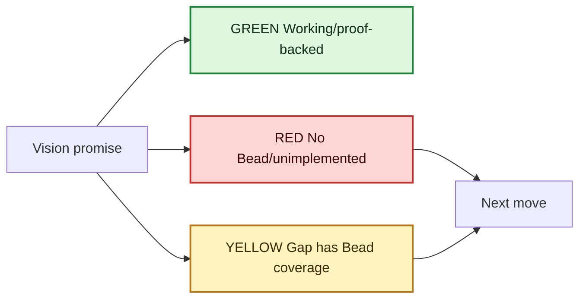
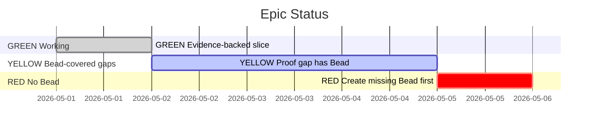
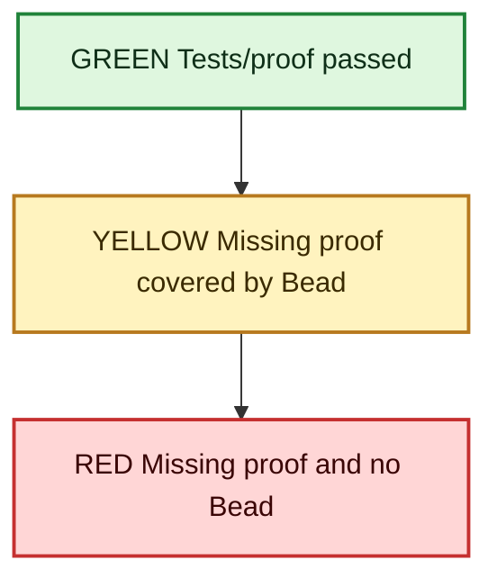

# Project Status MMDX

Turn a project reality check into a durable repo-local `.mmdx` decision surface:
current truth, primary flows, epics, schedule/status, architecture boundaries,
proof gaps, and linked deep dives. The artifact lives in the project being
checked, not in session memory or a global scratch directory.

## First Progress Marker

Start the first progress update with the exact prefix `Using project-status-mmdx`.

Preferred format:

`Using project-status-mmdx to update the repo-local where-we-are MMDX stack. First I will read the existing status stack, vision docs, Beads state, and proof surfaces.`

## Trigger Shape

Use this skill for prompts like:

- `$mmdx $eli-me all primary user flows epics gantt of where we are at $reality-check-for-project deep linked to each other including the ERD`
- `make a where-we-are MMDX for this repo`
- `update the project status MMDX after the reality check`
- `deep link the epic map, primary flows, gantt, and ERD`
- Any `$reality-check-for-project` run where a repo-local status `.mmdx` already exists.

Do not use this for one-off Mermaid diagrams that are not meant to become the
project's current-state artifact. Use `mmdx` directly for those.

## Success Contract

- Outcome: the current project has one obvious repo-local status stack.
- Outcome: that stack is published as one stable short link in the operator's
  `buildooor` mmdx account, edited in place on every run.
- Evidence: a `.mmdx` file exists under the project, has linked charts, and
  preflights cleanly with the `mmdx` skill.
- Evidence: every status-bearing chart uses the same reality-check stoplight:
  `GREEN` = working/proof-backed, `YELLOW` = not done but covered by Beads,
  `RED` = unimplemented/unproven and not covered by Beads.
- Evidence: the stack header records `shortLink` (`username: buildooor` + slug),
  and `publish-link` live-verifies the edited short link.
- Evidence: when no interactive browser is available, the headless
  `publish-link` lane is attempted and its receipt, live URL, or exact
  fail-closed auth reason is recorded in the Bead.
- Failure avoided: future agents do not recreate a prose-only reality check or
  write a disconnected diagram that goes stale immediately.
- Failure avoided: future agents do not blur "has a plan" with "works" or
  "has no bead coverage".
- Failure avoided: future agents do not mint a new short link each run or ask
  which mmdx account — it is always `buildooor`, and the existing diagram is
  edited in place.
- Failure avoided: publish Beads do not sit `status=blocked` merely because an
  interactive browser is unavailable while the headless lane can still run.

## File Placement

Always store the stack inside the current project repo.

1. Prefer updating an existing status stack:
   - `diagrams/*reality*.mmdx`
   - `diagrams/*status*.mmdx`
   - `diagrams/*where*.mmdx`
   - `docs/diagrams/*reality*.mmdx`
   - `docs/diagrams/*status*.mmdx`
2. If none exists, create:
   - `diagrams/<repo-slug>-primary-flows-reality.mmdx` when the prompt asks for
     primary flows, epics, gantt, or ERD.
   - `diagrams/<repo-slug>-project-status.mmdx` for a general status stack.
3. If `diagrams/` does not exist but `docs/diagrams/` does, use
   `docs/diagrams/`.
4. Never write the canonical stack to `/tmp`, session memory, global skill
   directories, or hidden harness state.

When updating an existing stack, preserve chart ids and links unless the old
ids are misleading. Patch statuses and evidence in place instead of creating a
parallel file.

## Evidence Order

Build the chart from project truth, not vibes.

1. Read `AGENTS.md`, `README.md`, and vision/plan/spec docs.
2. Inspect Beads if present: `br ready`, `br list --status=open`,
   `br list --status=in_progress`, and `br sync --status` when available.
3. Read existing repo-local diagrams, especially ERDs and prior status stacks.
4. Trace implementation surfaces for each major promise: routes, CLI commands,
   migrations, schemas, tests, proof artifacts, deploy/release notes.
5. Cross-check each non-green gap against Beads. If a gap has no open or
   in-progress bead, it is `RED`, not `YELLOW`.
6. Run repo-native checks that are cheap and relevant. If dependencies are
   missing, say exactly what was not run.

## Required Stack Shape

Default to an MMDX stack with this chart set. Merge or omit only when the repo
is too small for the chart to carry signal.

1. `main`: crux / decision surface. This is the entry chart, not an index page.
2. `epic-gantt`: current epic timeline or status Gantt.
3. `epic-map`: epic dependency map with `DONE`, `PARTIAL`, `PLANNED`,
   `FUTURE`, `BLOCKED`, or `UNKNOWN` labels.
4. `primary-flows`: user/operator/agent flows that define product value.
5. `lifecycle`: state machine or sequence diagram for the main runtime path.
6. `architecture-boundary`: repo boundary, shared-service boundary, or
   connector/platform ownership map.
7. `proof-status`: validation and evidence map. Include test/proof gaps.
8. `drift`: docs-vs-code-vs-Beads mismatch map.
9. `next-move`: smallest high-leverage next action or blocked gate.
10. `erd`: include when the project has meaningful persisted data.

Use MMDX links on high-leverage labels only. Do not make every node clickable.

Every chart that carries status must use the stoplight rule in both text and
color. Color is a reinforcement, not the source of truth: labels must include
`GREEN`, `YELLOW`, or `RED`.

## ERD Handling

If the repo already has an ERD, preflight it first, then reuse its current
source in the stack. Do not redraw from memory unless the existing ERD is
stale or broken.

Preferred search:

```bash
rg --files | rg '(^|/)(diagrams|docs/diagrams)/.*(erd|schema).*\\.mmdx?$'
rg --files | rg '(schema|migration|erd).*\\.mmdx?$'
```

If no ERD exists but the repo has migrations/schema files, create a compact ERD
child chart from those sources and label it `UNKNOWN` for tables/relations that
could not be verified.

## Reality-Check Stoplight

Use these labels in node text so the chart remains readable without color:

- `GREEN`: implemented, proof-backed, and no current reality-check gap.
- `YELLOW`: not done or not fully proven, but one or more open/in-progress
  Beads explicitly address the gap.
- `RED`: unimplemented, unproven, or materially drifted, with no Bead coverage.
- `GRAY`: explicitly out of current scope or not enough evidence to classify.

Do not infer `GREEN` from closed Beads alone. Use code/proof/release evidence.
Do not use `YELLOW` unless you can name the covering Bead id or title in the
node label, adjacent note, or final closeout. A plan document without a Bead is
`RED` until Beads cover it.

Use this Mermaid class palette in every flowchart-like chart:

```mermaid
classDef green fill:#dff7df,stroke:#20833a,stroke-width:2px,color:#0f2f18
classDef yellow fill:#fff3bf,stroke:#b7791f,stroke-width:2px,color:#3a2a00
classDef red fill:#ffd6d6,stroke:#c53030,stroke-width:2px,color:#3a0505
classDef gray fill:#eef2f7,stroke:#64748b,stroke-width:1px,color:#111827
```

For Gantt charts, use Mermaid's built-in task classes with labels:

- `done` for `GREEN`.
- `active` for `YELLOW`.
- `crit` for `RED`.

## Update Workflow

Resolve the sibling `mmdx` skill tools before running validation, open, or
publish commands:

```bash
MMDX_SKILL_DIR="$(cd "{{SKILL_DIR}}/../mmdx" && pwd)"
MMDX_SCRIPT="$MMDX_SKILL_DIR/scripts/mmd.py"
MMDX_INDEX_SCRIPT="$MMDX_SKILL_DIR/scripts/mmdx_index.py"
```

1. Find or choose the repo-local stack path.
2. Read the existing stack if present.
3. Run the `reality-check-for-project` evidence pass:
   - vision checklist
   - Beads coverage
   - implementation reality
   - proof gaps
   - docs/status drift
4. Patch the stack in place:
   - update statuses and dates
   - classify every status-bearing node with `GREEN`, `YELLOW`, `RED`, or
     `GRAY`
   - include Bead ids/titles on `YELLOW` nodes where practical
   - add/remove links for changed critical paths
   - refresh ERD child chart only if schema changed or existing ERD is stale
   - keep caveats inside `proof-status`, not only in final prose
5. Validate every chart:

```bash
python3 "$MMDX_SCRIPT" path/to/status.mmdx --preflight-only
python3 "$MMDX_SCRIPT" path/to/status.mmdx --fragment-only --no-preflight >/dev/null
```

6. Open the stack when the user asked to inspect it:

```bash
python3 "$MMDX_SCRIPT" path/to/status.mmdx --open
```

7. Publish the refreshed stack to the `buildooor` mmdx account by editing the
   existing short link in place (see "Publish to the buildooor mmdx account").
   If no interactive browser is available, use the headless publish lane by
   default.

## Publish to the buildooor mmdx account

The repo-local `.mmdx` is the source of truth; the operator also keeps one
shareable status diagram per project in their mmdx account. **The account is
always `buildooor`. Never ask which account, and never mint a parallel short
link — edit the existing one in place.**

Persistence: the short link the stack maps to lives in the stack header as a
`shortLink` object (`username` + `slug`). Read it first, then republish.

```bash
# 1. Read the recorded buildooor slug from the stack header
rg -n '"shortLink"|"slug"' diagrams/<repo-slug>-project-status.mmdx
```

If a slug is recorded, edit that short link in place. Auth and pako encoding
belong to the `mmdx` skill's `publish-link` flow (see its "Authenticated MMDX
Persistence" section) — do not build a separate auth path, and let it fail
closed if auth or live verification is unavailable.

```bash
# Dry-run the exact payload first when slug or source is uncertain
python3 "$MMDX_SCRIPT" publish-link \
  diagrams/<repo-slug>-project-status.mmdx \
  --username buildooor --slug <recorded-slug> --dry-run

# Edit the existing buildooor short link in place (republish + live-verify)
python3 "$MMDX_SCRIPT" publish-link \
  diagrams/<repo-slug>-project-status.mmdx \
  --username buildooor --slug <recorded-slug> \
  --title "<Repo> Project Status" \
  --access-token-command "spaps token --server-url $SPAPS_MMDX_AUTH_SERVER_URL"
```

### Headless publish lane

Auth, token discovery, publishing, and live verification are owned by the
sibling `mmdx` skill's "Authenticated MMDX Persistence" and `publish-link`
sections. This skill adds only the project-status deltas:

1. Read the stack header and validate the source before publishing.
2. Preserve `shortLink`: `username: buildooor` + slug.
3. Reuse the same slug on each status refresh; never mint a parallel link.
4. Attempt `mmdx publish-link` headlessly before blocking on browser access.
5. Record the receipt, live URL, or exact fail-closed reason in the Bead.

Record the receipt in the publish Bead: the command shape, source path,
`buildooor` username, slug, live `/mmdx/buildooor/<slug>` URL, and the
`publish-link` verification result or exact fail-closed reason. Only block the
smallest publish Bead after this lane has been attempted or proven unavailable;
lack of an interactive browser alone is not a blocker.

First publish only (no slug recorded yet): mint the first short link
headlessly, live-verify it, and write the returned `shortLink` into the local
`.mmdx` header:

```bash
python3 "$MMDX_SCRIPT" publish-link \
  diagrams/<repo-slug>-project-status.mmdx \
  --create \
  --title "<Repo> Project Status" \
  --write-short-link-metadata \
  --access-token-command "spaps token --server-url $SPAPS_MMDX_AUTH_SERVER_URL"
```

```json
"shortLink": { "username": "buildooor", "slug": "mmdx-XXXXXXXX" }
```

If the create command returns `402 DIAGRAMS_PRO_REQUIRED`, relay the structured
paywall error from `mmdx publish-link` with the `$15/month` price context,
preserve the local stack, and record the exact failure in the publish Bead. Do
not fall back to a browser-only first mint unless the headless create lane is
unavailable for a reason other than auth, entitlement, or live verification.

If auth is unavailable after the headless lane reports the exact device-code
recipe or token-command failure, record that receipt and the existing or
returned slug when one exists, leave the repo-local stack updated, and stop —
do not mint a new diagram to work around missing auth.

## MMDX Skeleton

Start from
`assets/templates/project-status-stack.mmdx` when creating a new stack. Use this
minimal shape when writing inline from scratch, then expand with repo-specific
charts:

````markdown
<!-- mmdx
{
  "entry": "main",
  "shortLink": { "username": "buildooor", "slug": "" },
  "links": [
    {
      "from": "main",
      "label": "Open epic status",
      "to": "epic-gantt",
      "title": "Open epic status"
    },
    {
      "from": "main",
      "label": "Open proof gaps",
      "to": "proof-status",
      "title": "Open proof gaps"
    }
  ]
}
-->

## chart main Project Status Crux


## chart epic-gantt Epic Status


## chart proof-status Proof Status

````

## Eli-Me Closeout Shape

When `eli-me` is in the invocation, close with:

1. Crux: one sentence.
2. Artifact path: repo-local `.mmdx` path.
3. Published: the `buildooor` short link URL that was edited in place.
4. What changed: chart count and linked surfaces.
5. Verified: exact preflight/check + publish commands that passed.
6. Blocked/unverified: exact checks not run and why.
7. Next move: one concrete recommendation.

No generic "let me know if" ending.

## Anti-Patterns

- Writing only a prose reality check when the user asked for MMDX.
- Creating a fresh status stack when a repo-local one already exists.
- Storing the artifact in a global skill dir, `/tmp`, or session memory.
- Claiming Beads complete means project complete.
- Marking a gap `YELLOW` without a real open/in-progress Bead that addresses it.
- Using color without `GREEN` / `YELLOW` / `RED` labels in node text.
- Omitting the ERD when the prompt asked for it and a valid ERD exists.
- Hiding validation caveats in the final message instead of putting them in the
  `proof-status` chart.
- Recreating an ERD from memory instead of reusing or verifying repo sources.
- Minting a new short link each run instead of editing the existing buildooor
  one recorded in the stack header `shortLink`.
- Asking which mmdx account to publish to — it is always `buildooor`.
- Parking a publish Bead as blocked for lack of interactive browser access
  before attempting the documented headless publish lane.
- Building a separate publish/auth path instead of delegating to the `mmdx`
  skill's `publish-link` flow.

## Validation

Before finishing, run:

```bash
MMDX_SKILL_DIR="$(cd "{{SKILL_DIR}}/../mmdx" && pwd)"
MMDX_SCRIPT="$MMDX_SKILL_DIR/scripts/mmd.py"
python3 "$MMDX_SCRIPT" path/to/status.mmdx --preflight-only
python3 "$MMDX_SCRIPT" "{{SKILL_DIR}}/assets/templates/project-status-stack.mmdx" --preflight-only
```

If this skill changes, validate it from the skills checkout:

```bash
python3 "{{SKILL_DIR}}/../skill-issue/scripts/quick_validate.py" "{{SKILL_DIR}}"
```
